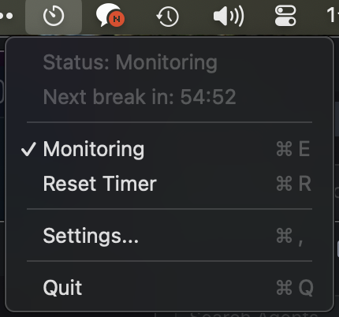

# Teumnirm

**A macOS app that monitors your computer usage time and reminds you to take breaks**

> **Note**: This project was entirely built using AI tools (Claude, Cursor).

The name "Teumnirm" combines the Korean word "teum" (틈, meaning break/gap) and the Middle Korean word "nirm" (니름, meaning notification/announcement), signifying "notifying you of break time."

Teumnirm detects keyboard/mouse activity and blurs the screen after 55 minutes of continuous use, while turning Philips Hue lights red to remind you to take a break.

[한국어 README](README_ko.md)

## Features

- **Activity Monitoring**: Tracks computer usage time by detecting keyboard/mouse input
- **Screen Blur**: Blurs the entire screen after a configured period of time
- **Philips Hue Integration**: Changes lights to red for visual notification
- **Auto Recovery**: Automatically restores to normal state after 5 minutes
- **Menu Bar App**: Easy control from the system menu bar

## Screenshots

When it's time for a break:
1. The screen becomes blurred
2. A "Break Complete" button appears
3. Philips Hue lights turn red

## Installation

You can download the latest version from the [GitHub Releases](https://github.com/sytronik/teumnirm/releases) page.

## Usage

### Basic Usage

1. When you launch the app, a timer icon appears in the menu bar
    
2. The app automatically monitors keyboard/mouse activity
3. After 55 minutes (default) of continuous use, the screen becomes blurred
4. Click the "Break Complete" button after your break, or it will auto-dismiss after 5 minutes

### Permissions

#### Input Monitoring

Input monitoring permission is required to detect keyboard/mouse activity.

1. **System Settings** > **Privacy & Security** > **Input Monitoring**
2. Enable Teumnirm

#### Local Network (When using Philips Hue)

Local network access permission is required to communicate with the Hue bridge.

### Philips Hue Setup

1. Click the menu bar icon > **Settings...**
2. Select the **Philips Hue** tab
3. Enable **Use Philips Hue Integration**
4. Use **Auto Discovery** to find the bridge (or enter the IP manually)
5. Press the button on your Hue bridge, then click **Connect to Bridge**
6. Select the lights to control

### Settings Options

- **Break Reminder Interval**: 20 to 120 minutes (default: 55 minutes)
- **Auto Dismiss Time**: 3 to 15 minutes (default: 5 minutes)
- **Compatibility Mode**: Enable if the blur is not displaying properly

## Privacy

- All data is processed locally
- Keyboard/mouse input content is not recorded; only activity presence is detected
- Network communication is only used for local communication with the Philips Hue bridge

## License

MIT License

## Acknowledgments

- [posturr](https://github.com/tldev/posturr) - Reference for screen blur implementation
- [rainygirl's blog post](https://rainygirl.github.io/2021/11/pomodoro-room-light-timer) - Inspiration for Philips Hue integration

---

## For Developers

### Build From Source

#### Requirements

- macOS 13.0 (Ventura) or later
- Xcode Command Line Tools (`xcode-select --install`)
- (Optional) Philips Hue Bridge

#### Build

```bash
git clone https://github.com/yourusername/teumnirm.git
cd teumnirm
./build.sh
```

The built app will be created at `build/Teumnirm.app`.

#### Run

```bash
open build/Teumnirm.app
```

Or copy `Teumnirm.app` to your `/Applications` folder.

### Project Structure

```
teumnirm/
├── Sources/
│   ├── main.swift              # App entry point
│   ├── AppDelegate.swift       # Main coordinator
│   ├── Models.swift            # Data models
│   ├── ActivityMonitor.swift   # Activity detection
│   ├── BlurOverlay.swift       # Screen blur
│   ├── HueController.swift     # Philips Hue control
│   ├── ConfirmWindow.swift     # Confirmation window
│   └── SettingsWindow.swift    # Settings window (SwiftUI)
├── Package.swift
├── build.sh
└── README.md
```

### Tech Stack

- **Swift 5.9+**
- **SwiftUI** (Settings window)
- **AppKit** (Menu bar, overlay)
- **IOKit/CoreGraphics** (Input event detection)
- **Philips Hue REST API** (Light control)
