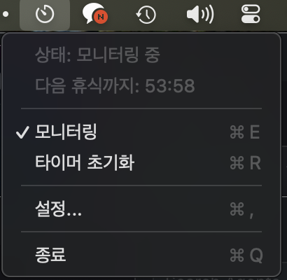

# Teumnirm (틈니름)

**컴퓨터 사용 시간을 모니터링하고 휴식을 알려주는 macOS 앱**

> **참고**: 이 프로젝트는 AI 툴(Claude, Cursor)을 사용하여 개발되었습니다.

Teumnirm(틈니름)은 한국어 '틈'과 중세한국어 '니름'의 합성어로, 휴식 시간을 알려준다는 의미입니다.

Teumnirm은 키보드/마우스 활동을 감지하여 55분 연속 사용 시 화면을 블러 처리하고, Philips Hue 조명을 빨간색으로 바꿔 휴식을 알려줍니다.

## 기능

- **활동 모니터링**: 키보드/마우스 입력을 감지하여 컴퓨터 사용 시간 추적
- **비활동 일시정지**: 3분간 키보드/마우스 입력 없으면 타이머가 일시정지되고, 다시 활동 시 재개
- **화면 블러**: 설정된 시간이 지나면 화면 전체를 블러 처리
- **Philips Hue 연동**: 조명을 빨간색으로 변경하여 시각적 알림 제공
- **자동 복구**: 5분 후 자동으로 원래 상태로 복귀
- **메뉴바 앱**: 시스템 메뉴바에서 간편하게 제어

## 스크린샷

휴식 시간이 되면:
1. 화면이 블러 처리됩니다
2. "휴식 완료" 버튼이 표시됩니다
3. Philips Hue 조명이 빨간색으로 바뀝니다

## 설치

[GitHub Releases](https://github.com/sytronik/teumnirm/releases) 페이지에서 최신 버전을 다운로드할 수 있습니다.

### "손상되었기 때문에 열 수 없습니다" 경고 해결

다운로드한 앱을 처음 실행할 때 **"Teumnirm이(가) 손상되었기 때문에 열 수 없습니다"** 경고가 나타날 수 있습니다. 이는 앱이 Apple의 공증(notarization)을 받지 않아서 발생하는 현상입니다.

터미널에서 다음 명령어를 실행하면 해결됩니다:

```bash
xattr -cr ~/Downloads/Teumnirm.app
```

> 다운로드 위치가 다르다면 경로를 적절히 수정하세요 (예: `/Applications/Teumnirm.app`)

## 사용 방법

### 기본 사용

1. 앱을 실행하면 메뉴바에 타이머 아이콘이 나타납니다
    
2. 앱이 자동으로 키보드/마우스 활동을 모니터링합니다
3. 55분(기본값) 연속 사용 후 화면이 블러 처리됩니다
4. 휴식 후 "휴식 완료" 버튼을 클릭하거나 5분 후 자동 해제됩니다

### 권한 설정

#### 입력 모니터링 (Input Monitoring)

키보드/마우스 활동을 감지하려면 입력 모니터링 권한이 필요합니다.

1. **시스템 설정** > **개인 정보 보호 및 보안** > **입력 모니터링**
2. Teumnirm 활성화

#### 로컬 네트워크 (Philips Hue 사용 시)

Hue 브릿지와 통신하려면 로컬 네트워크 접근 권한이 필요합니다.

### Philips Hue 설정

1. 메뉴바 아이콘 클릭 > **설정...**
2. **Philips Hue** 탭 선택
3. **Philips Hue 연동 사용** 활성화
4. **자동 검색**으로 브릿지 찾기 (또는 IP 직접 입력)
5. Hue 브릿지의 버튼을 누른 후 **브릿지 연결하기** 클릭
6. 제어할 조명 선택

### 설정 옵션

- **휴식 알림 간격**: 20분 ~ 120분 (기본 55분)
- **자동 해제 시간**: 3분 ~ 15분 (기본 5분)
- **호환 모드**: 블러가 제대로 표시되지 않을 경우 활성화

## 개인정보 보호

- 모든 데이터는 로컬에서만 처리됩니다
- 키보드/마우스 입력 내용은 기록되지 않고, 활동 여부만 감지합니다
- 네트워크 통신은 Philips Hue 브릿지와의 로컬 통신에만 사용됩니다

## 라이선스

MIT License

## 참고한 프로젝트

- [posturr](https://github.com/tldev/posturr) - 화면 블러 구현 참고
- [rainygirl's blog post](https://rainygirl.github.io/2021/11/pomodoro-room-light-timer) - Philips Hue 연동 아이디어

---

## 개발자를 위한 안내

### 직접 빌드

#### 요구사항

- macOS 13.0 (Ventura) 이상
- Xcode Command Line Tools (`xcode-select --install`)
- (선택) Philips Hue Bridge

#### 빌드

```bash
git clone https://github.com/yourusername/teumnirm.git
cd teumnirm
./build.sh
```

빌드된 앱은 `build/Teumnirm.app`에 생성됩니다.

#### 실행

```bash
open build/Teumnirm.app
```

또는 `Teumnirm.app`을 `/Applications` 폴더로 복사하세요.

### 프로젝트 구조

```
teumnirm/
├── Sources/
│   ├── main.swift              # 앱 진입점
│   ├── AppDelegate.swift       # 메인 코디네이터
│   ├── Models.swift            # 데이터 모델
│   ├── ActivityMonitor.swift   # 활동 감지
│   ├── BlurOverlay.swift       # 화면 블러
│   ├── HueController.swift     # Philips Hue 제어
│   ├── ConfirmWindow.swift     # 확인 창
│   └── SettingsWindow.swift    # 설정 창 (SwiftUI)
├── Package.swift
├── build.sh
└── README.md
```

### 기술 스택

- **Swift 5.9+**
- **SwiftUI** (설정 창)
- **AppKit** (메뉴바, 오버레이)
- **IOKit/CoreGraphics** (입력 이벤트 감지)
- **Philips Hue REST API** (조명 제어)
